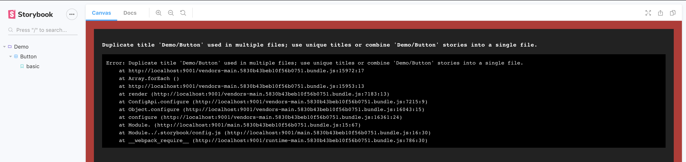

# Storybook issue

The [CFS Stories with MDX Docs](https://github.com/storybookjs/storybook/blob/v5.2.8/addons/docs/docs/recipes.md#csf-stories-with-mdx-docs) example documents how to have adjacent `.stories.js`. and `.stories.mdx` files for the same component, but the example actually causes an error: `Duplicate title 'Demo/Button' used in multiple files; use unique titles or combine 'Demo/Button' stories into a single file.`.

## Setup

1. `git clone https://github.com/schneidmaster/storybook/error/demo`
2. `yarn install`
3. `yarn storybook`
4. Wait for storybook to start up, see error

